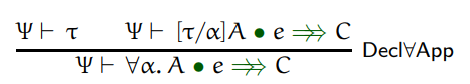
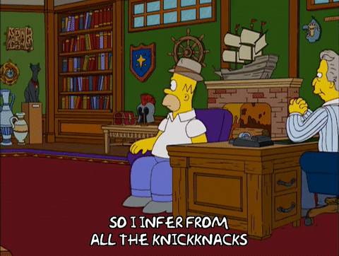
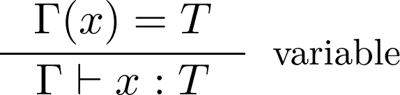
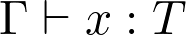

class: center
name: title
count: false

# Type theory for busy engineers

.p60[]

.me[.grey[*by* **Nicholas Matsakis**]]
.left[.citation[View slides at `https://nikomatsakis.github.io/rustnl-2024/`]]

---

# Me

---

# What I am here today to talk about

`a-mir-formality`

???

I've been working on this project called "a mir formality".

The idea is to give us a more formal definition of the Rust type system, one we can easily play with.

--

or, more precisely, `formality-core`

???

But I'm not going to talk about a-mir-formality in detail today.

Instead, I want to talk about the systme that underlies it, dubbed `formality-core`.

---

# formality-core

Rust : Concurrency :: formality-core : Type Systems

???

Rust, thanks to memory safety, makes systems programming into something kind of fun.

The purpose of Rust, in my mind, is to take "systems programming"
from something "wizard-like" to something "everyday".

Formality-core aims to do the same for type 

---

# Introducing `eg`

```rust
let x = 22;
let y = 44;
x + y
```

prints....

```
66
```

--

.p40[]

---

# But wait, there's more!

```rust
let x = (1, 2);
let y = (22, 44);
x + y
```

prints

```
(23, 46)
```

---

# Functions

```rust
fn add(x: u32, y: u32) -> u32 {
    x + y
}

@add(22, 44)
```

prints

```
66
```

---
name: generics

# Heck, even generics

```rust
fn add<type A>(x: A, y: A) -> A {
    x + y
}

let x = @add<u32>(22, 44);
let y = @add<(u32, u32)>((1, 2), (3, 4));
(x, y)
```

prints

```
(66, (4, 6))
```

---
template: generics

.line5[]

---
template: generics

.line6[]

---

# How do we define a program?

```rust
Program = FnDefn* Expr
```

Using a **grammar**.

---
name: program-defn

# In formality-core

```rust
// Program = FnDefn* Expr

#[term($*fn_defns $expr)]
pub struct Program {
    pub fn_defns: Vec<FnDefn>,
    pub expr: Expr,
}
```

---
template: program-defn

.line3[]

The `#[term]` macro indicates a part of the program AST.

Generates a lot of boilerplate traits.

Includes a grammar used for parsing and pretty-printing.

---
template: program-defn

.arrow.abspos.left90.top145.rotSE[]

Each `$` parses value of a field

---
template: program-defn

.arrow.abspos.left100.top145.rotSE[]

The `*` parses a "vec out of zero or more instances"

---
template: program-defn

.arrow.abspos.left200.top145.rotSE[]

Here we parse a single `Expr` as the value of `expr`

---

# Expression grammar

```rust
Expr = Integer             // e.g., 22
     | Id                  // e.g., `x`
     | ( Expr, ..., Expr )
     | ...
```

---
name: expr

# In formality

```rust
#[term]
pub enum Expr {
    #[grammar($v0)]
    Integer(u32),

    #[grammar($v0)]
    Var(Id),

    #[grammar($(v0))]
    Tuple(Vec<Expr>),

    // ...
}

formality_core::id!(Id);
```

---
template: expr

.arrow.abspos.left20.top95.rotSE[]

Term on an enum indicates many options

---
template: expr

.arrow.abspos.left45.top180[]

Each variant has a grammar attached to it

---
template: expr

.arrow.abspos.left220.top155.rotSW[]

Anonymous fields are called `v0`, `v1`, etc

---
template: expr

.arrow.abspos.left45.top290[]
.arrow.abspos.left10.top500[]

`formality_core::id!()` declares an "identifier" -- a string, basically

---
template: expr

.arrow.abspos.left210.top315.rotSW[]

`$(v0)` parses a comma separated list in parentheses

---

# Expression grammar, cont'd

```rust
Expr = ...
     | Expr + Expr
     | Expr - Expr
     | Expr * Expr
     | Expr / Expr
     | ...
```

---
name: exprop

# In formality

```rust
#[term]
pub enum Expr {
    // ...

    #[grammar($v0 + $v1)]
    #[precedence(0)]
    Add(Arc<Expr>, Arc<Expr>),

    // ...

    #[grammar($v0 * $v1)]
    #[precedence(1)]
    Mul(Arc<Expr>, Arc<Expr>),

    // ...
}
```

---
template: exprop

.arrow.abspos.left45.top262[]
.arrow.abspos.left40.top422[]

precedence annotations help avoid parsing ambiguity

---
template: exprop

.arrow.abspos.left100.top322.rotNE[]

recursive types typically use `Arc`

---
name: exprlet

# Expression grammar, cont'd

```rust
Expr = ...
     | let Id = Expr; Expr  // e.g., let x = 22 + 44; x * 3
     | ...
```

---
template: exprlet

.arrow.abspos.left130.top180.rotNE[]

Declare a local variable (e.g., `x`)...

---
template: exprlet

.arrow.abspos.left180.top180.rotNE[]

...with this initial value (e.g., `22+44`)...

---
template: exprlet

.arrow.abspos.left240.top180.rotNE[]

...and then executes this expression, with the variable in scope.

---
template: exprlet

In formality:

```rust
#[term]
pub enum Expr {
    // ...

    #[grammar(let $v0 = $v1; $v2)]
    Let(Id, Arc<Expr>, Arc<Expr>),

    // ...
}
```

---

# Example 0

```rust
let x = 22;
let y = 44;
x + y * 3 + 66
```

???

At this point we've seen enough grammar to express some non-trivial expressions.

We've also done enough work in formality to start testing our parser.

But before we can do that, I hvae to show you one bit of boilerplate.

---
name: eglang

# Declaring the language

```rust
formality_core::declare_language! {
    mod eg_lang {
        const NAME = "Eg";
        // ... 4 lines I'm not showing you yet ...
        const KEYWORDS = [
            "fn",
            "type",
            "u32",
            "let",
        ];
    }
}

use eg_lang::FormalityLang;
```

---
template: eglang

.arrow.abspos.left100.top180.rotNE[]

Declare the language module

---
template: eglang

.arrow.abspos.left95.top265.rotNE[]

Identifiers declared with `Id` will automatically not accept keywords.

---
template: eglang

.arrow.abspos.left10.top500[]

Macros like `#[term]` reference `crate::FormalityLang`

---

# Let's write some tests

```rust
#[test]
fn parse_expr_let() {
    let e: Expr = eg_lang::term(
        "
            let x = 22;
            let y = 44;
            x + y * 3 + 66
        ",
    );

    // ...
}
```

---
# Type-checking

```rust
22 + 44             // ✅
```

--

```rust
(22, 44) + (66, 88) // ✅
```

--

```rust
(22, 44) + 66       // ❌
```

---
name: egtypes

# Types in eg

```rust
T = u32
  | ( T, ..., T )
  | ...
```

--

in formality:

```rust
#[term]
pub enum Ty {
    #[grammar(u32)]
    U32,

    #[grammar($(v0))]
    Tuple(Vec<Ty>),

    // ...
}
```

---
name: infrules

# Inference rules



--

.p40[]

---

# Inference rules

.arrow.abspos.left10.top70.rotNE[]

--



.arrow.abspos.left230.top400.rotSE[]

---

# Inference rules

```rust
    X               Y
    -------------------------------- R
    Z
```

Read as: "If X and Y, then Z"

R is just the name of the rule

Sometimes there are no conditions.

---
name: inf-rule-var

# Inference rule for variables

.p40[]

.footnote[
    Rendered with https://www.quicklatex.com/
]


---
name: gamma-x-t

# What is this?

.p20[]

--

A *predicate* -- a single thing we can say is true or false

---
template: gamma-x-t

.arrow.abspos.left160.top170.rotNE[]

--

*Variables*<sup>1</sup> referencing the grammar.

.footnote[
    <sup>1</sup> More properly, *metavariables*, to distinguish them from the variables
    in the program being typechecked
]

--

T means "some type", like `u32`.

---
template: gamma-x-t

.arrow.abspos.left15.top170.rotNE[]

&Gamma; is often used for a typing *environment*

--

In formality:

```rust
#[derive(Clone, Debug, Ord, Eq, PartialEq, PartialOrd, Hash)]
pub struct Env {
    program: Arc<Program>,
    type_variables: Vec<Variable>,
    program_variables: Map<Id, Ty>,
}
```

---
template: inf-rule-var

.arrow.abspos.left70.top210.rotNE[]
.arrow.abspos.left130.top210.rotNE[]

Most of this other stuff? Arbitrary.

Typical convention:
* `A ⊢ B` means "given the assumptions A, we conclude B"
    * "A 'lets us say' B"
* `:` means "has type"

---
# In a-mir-formality

---

# Typing rules for eg

```rust
#[term]
pub enum Expr {
    #[grammar($v0)]
    Integer(u32),
    // ...
}
```

.arrow.abspos.left10.top60[]

---


# Typing rules for eg

```

------------------
Γ ⊢ N : u32
```